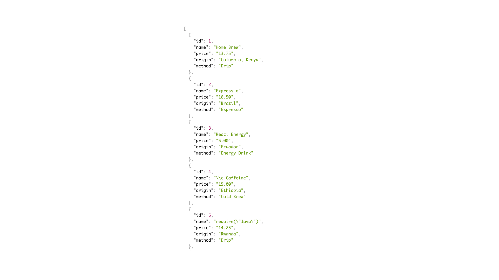
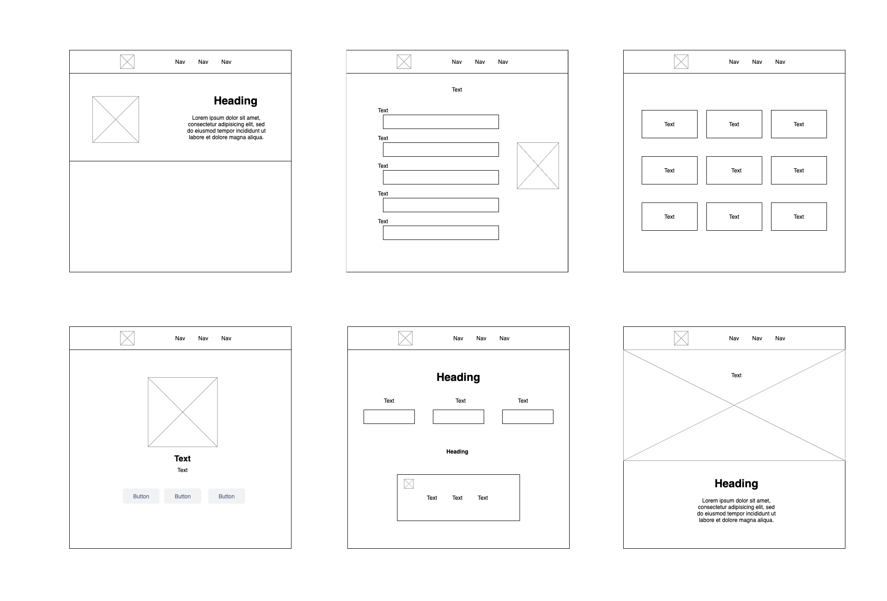
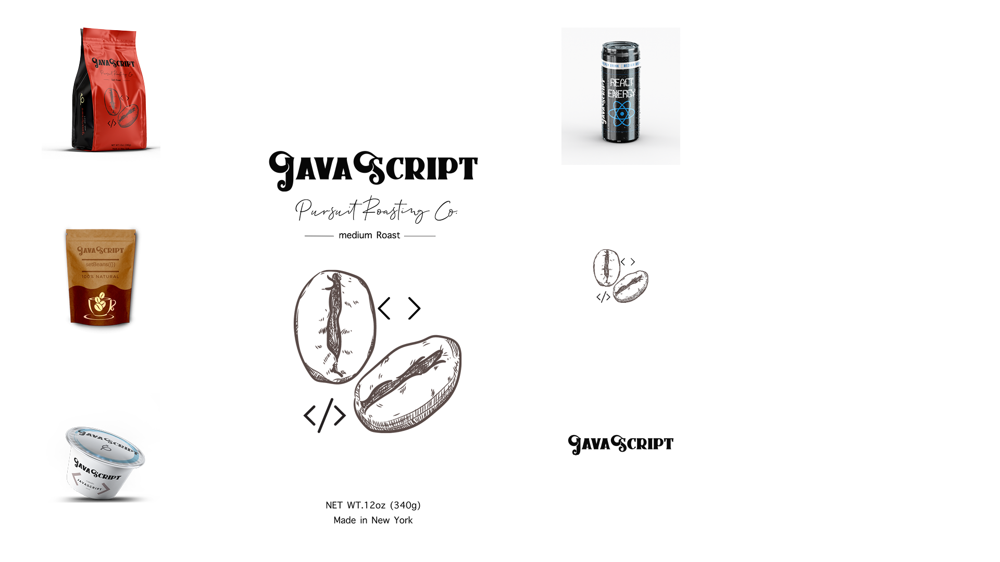
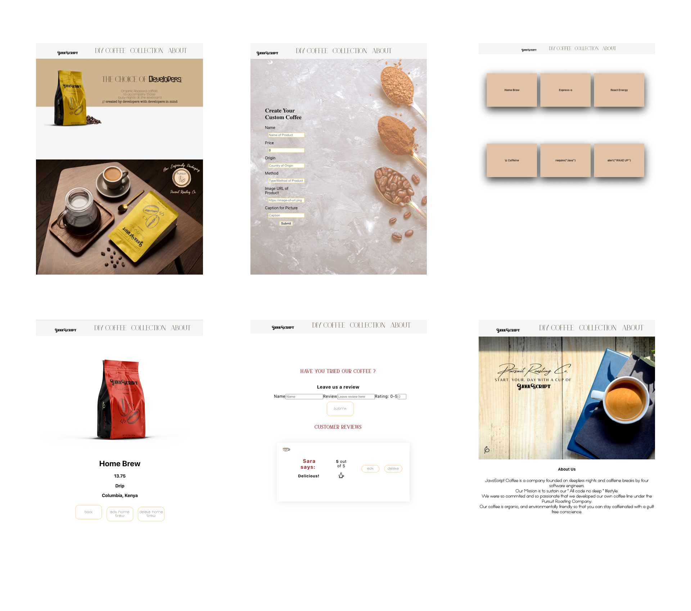

# JavaScript Coffee Brand

### Overview
A PERN stack coffee website. Showcasing our knowledge in implementing Express, PostgreSQL, NodeJS and React.

Netlify: https://quizzical-yonath-00eaa3.netlify.app/
Heroku: https://salty-spire-03163.herokuapp.com/

#### Table of Contents
- 1. [ Development ](#development)
  * Express
  * PostreSQL
  * ReactJS
- 2. [ Design ](#design)
    * Wireframe
    * Branding
    * Package Design
    * Hifi Mockup
 - - -

### Development
- - -
#### Express - Server
We created our server using [Express](https://expressjs.com/) for our client request to several endpoints.

#### PostgreSQL
Our database was designed using [PostgreSQL](https://www.postgresql.org/) to store the data associated with our coffee as well as the user reviews. Our website uses full CRUD for our custom coffee form/our edit form and allows the user to create, edit and delete their customizations and comments.

#### ReactJS
React is the vehicle transferring our contents to and from the back end. Allowing the user to access the info we have stored and through our front-end functionality allows our database to update based on what is entered by our forms and stored to our database.

- - -
### Design
#### Wireframe
After we decided on what we wanted our store to be (coffee), it was time to figure out how we wanted to set up our web store. We knew we wanted something that would bold, but not loud. We came up with a wireframe that we were happy with using [Draw.io](https://app.diagrams.net/).

- - -

#### Logo, Design and Package Design
Now if we were gonna design a coffee comapny we needed a logo, a product and packaging. Using [InDesign](https://www.adobe.com/products/indesign/free-trial-download.html) and [Photoshop](https://www.adobe.com/products/photoshop/landpa.html?sdid=KKQIN&mv=search&kw=photoshop&ef_id=Cj0KCQjwl_SHBhCQARIsAFIFRVWMDYmvecgHVCAZrwhp_GCtN4-AA-v2ZyI3N69YDzlihIZXv_UMJ8gaAm7dEALw_wcB:G:s&s_kwcid=AL!3085!3!522504775617!e!!g!!adobe%20photoshop!1712238394!67643541820&gclid=Cj0KCQjwl_SHBhCQARIsAFIFRVWMDYmvecgHVCAZrwhp_GCtN4-AA-v2ZyI3N69YDzlihIZXv_UMJ8gaAm7dEALw_wcB)we created the logo first and then using 3D modeling the pakages were designed. The label was then created and JavaScript Coffee was created.

- - -
#### Hifi-Mockup
Once the wirerame and product creation was done, it was time to create a more realistic and detailed version of our website. Using [Adobe XD](https://www.adobe.com/creativecloud/business/enterprise/xd.html?sdid=3NQZBDR7&mv=Search&ef_id=Cj0KCQjwl_SHBhCQARIsAFIFRVV6lTGdp76AWs550HaWenWpQgQn4mfmEHXOyLSGMuBUYU4qQ1_dRTwaAmWAEALw_wcB:G:s&s_kwcid=AL!3085!3!341663403266!e!!g!!adobe%20xd!1756849678!69408408715) We replicated the format of the wireframe and imported fonts and the images designed.

